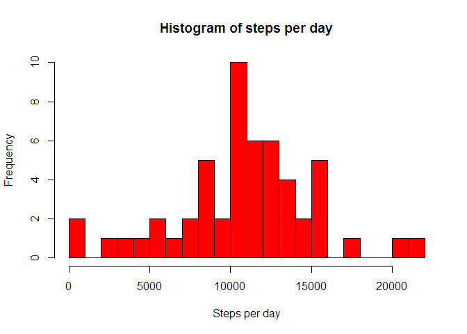
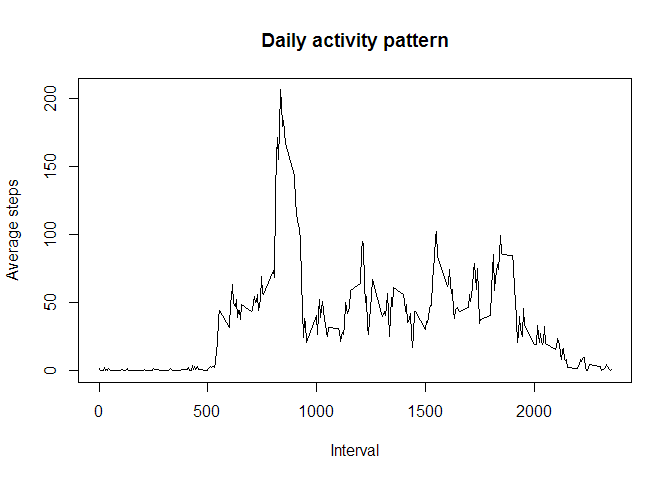
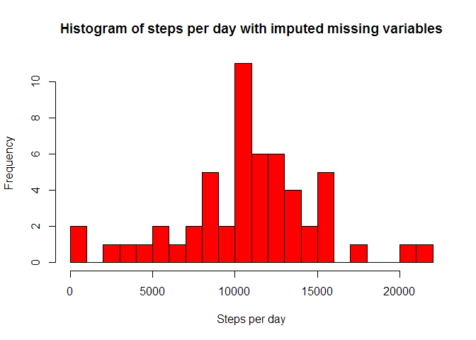
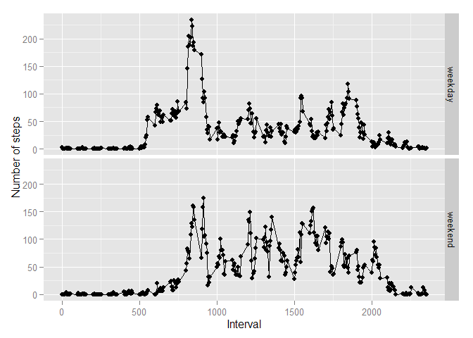

# Reproducible Research: Peer Assessment 1


## Loading and preprocessing the data

Load the data from CSV file

```r
data <- read.csv("activity.csv", stringsAsFactors=FALSE)
str(data)
```

```
## 'data.frame':	17568 obs. of  3 variables:
##  $ steps   : int  NA NA NA NA NA NA NA NA NA NA ...
##  $ date    : chr  "2012-10-01" "2012-10-01" "2012-10-01" "2012-10-01" ...
##  $ interval: int  0 5 10 15 20 25 30 35 40 45 ...
```

Parse strings as date

```r
data$date <- as.Date(data$date)
```

Show summary of the data

```r
summary(data)
```

```
##      steps             date               interval     
##  Min.   :  0.00   Min.   :2012-10-01   Min.   :   0.0  
##  1st Qu.:  0.00   1st Qu.:2012-10-16   1st Qu.: 588.8  
##  Median :  0.00   Median :2012-10-31   Median :1177.5  
##  Mean   : 37.38   Mean   :2012-10-31   Mean   :1177.5  
##  3rd Qu.: 12.00   3rd Qu.:2012-11-15   3rd Qu.:1766.2  
##  Max.   :806.00   Max.   :2012-11-30   Max.   :2355.0  
##  NA's   :2304
```

## What is mean total number of steps taken per day?

Sum the number of steps taken each day

```r
stepsPerDay <- aggregate(data$steps, by=list(day = data$date), FUN=sum)
```

Draw a histogram of the values

```r
hist(stepsPerDay$x, breaks=20, col='red', main="Histogram of steps per day", xlab="Steps per day")
```

 

Calculate the mean and median values

```r
mean <- mean(stepsPerDay$x, na.rm=TRUE)
median <- median(stepsPerDay$x, na.rm=TRUE)
```
The mean value is 1.0766189\times 10^{4}
The median value is 10765

## What is the average daily activity pattern?

Average the number of steps taken during each interval for all days

```r
dailyAverage = aggregate(data$steps, by=list(interval = data$interval), FUN=mean, na.rm=TRUE)
```

Plot the daily activity pattern

```r
plot(dailyAverage$interval, dailyAverage$x, type='l', xlab="Interval", ylab="Average steps", main="Daily activity pattern")
```

 

Find max average value across day

```r
max <- max(dailyAverage$x)
maxInterval <- dailyAverage$interval[which.max(dailyAverage$x)]
```
The max average value is 206.1698113, it occurs for interval 835

## Imputing missing values

Calculate the number of missing values

```r
naIntervals <- sum(is.na(data$steps))
naDays <- sum(is.na(stepsPerDay$x))
```
There are total 2304 intervals with missing values and 8 whole days with missing values.

Filling the missing values with mean value calculated from other days:

```r
dataFilled <- data
for(i in 1:length(data$steps)){
  if(is.na(data$steps[i])){
    dataFilled$steps[i] = dailyAverage$x[i]
  }
}
```

Sum the number of steps taken each day

```r
stepsPerDayFilled <- aggregate(dataFilled$steps, by=list(day = data$date), FUN=sum)
```

Draw a histogram of the values

```r
hist(stepsPerDayFilled$x, breaks=20, col='red', main="Histogram of steps per day with imputed missing variables", xlab="Steps per day")
```

 

Calculate the mean and median values

```r
meanFilled <- mean(stepsPerDayFilled$x, na.rm=TRUE)
medianFilled <- median(stepsPerDayFilled$x, na.rm=TRUE)
```
The mean value is 1.0766189\times 10^{4}
The median value is 1.0765594\times 10^{4}

The results differ, but not very much.

## Are there differences in activity patterns between weekdays and weekends?

Add weekday/weekend factor to original data

```r
data$day <- as.factor(ifelse(grepl("Saturday|Sunday",weekdays(data$date)), "weekend", "weekday"))
```

Aggregate the data by interval and day type

```r
weekDailyAverage <- aggregate(data$steps, by=list(interval = data$interval, day = data$day), FUN=mean, na.rm=TRUE)
```

Plot the daily activity patterns for weekends and weekdays

```r
qplot(interval, x,  data  =  weekDailyAverage,  facets = day~., xlab="Interval", ylab="Number of steps") + geom_line()
```

 


